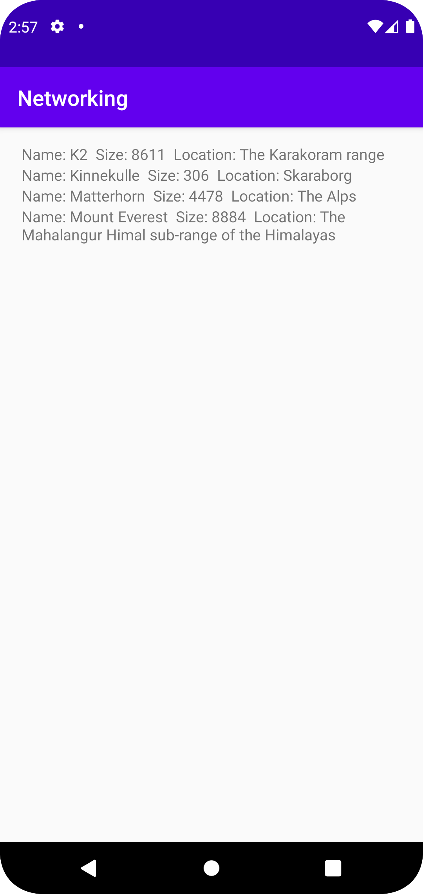

# 1: Att skapa min RecyclerView:

Det absolut första jag börjde med att göra under denna uppgiften var
att skapa min RecyclerView. RecyclerView:n skapades i activity_main.xml
och implementerades snabbt genom att välja en RecyclerView i android-studio:s
Design läge.

### Följande kod är då min RecyclerView (1).
```
<androidx.recyclerview.widget.RecyclerView
     android:id="@+id/recyclerview"
     android:layout_width="match_parent"
     android:layout_height="match_parent"
     android:layout_marginStart="20dp"
     android:layout_marginTop="15dp"
     android:layout_marginEnd="15dp"
     android:layout_marginBottom="20dp"

     app:layout_constraintBottom_toBottomOf="parent"
     app:layout_constraintEnd_toEndOf="parent"
     app:layout_constraintStart_toStartOf="parent"
     app:layout_constraintTop_toTopOf="parent" 
/>
```

# 2: Att skapa Items till min RecyclerView:

Efter första steget att skapa min RecyclerView så behövde jag också
skapa en ny XML-fil som jag döpte till recyclerview_items.xml.
I denna XML-filen så skapade jag en TextView, som då kommer vara
den View som presenterar varje berg med respektive information
för sig.

### Följande kod är min TextView / Items (2).
```
<TextView
     android:id="@+id/name"
     android:layout_width="match_parent"
     android:layout_height="wrap_content"
     app:layout_constraintTop_toTopOf="parent"
     app:layout_constraintStart_toStartOf="parent"
/>
```

# 3: Hämta RecyclerView i min MainActivity:

Det jag gjorde efter tidigare steg var att jag började med att hämta
min RecyclerView i min MainActivity.java. Detta gjorde jag genom att först
skapa en "Private RecyclerView recyclerview" och som jag sedan
hänvisade till min XML-fil, där recyclerviewn befinner sig, med samma ID.
På följande sätt hänvisade jag min recyclerview i MainActivity.java
till min RecyclerView i activity_main.xml

### Dekleration av recyclerview (3):
```
RecyclerView view = findViewById(R.id.recyclerview);
```

# 4: Att skapa ArrayList, LayoutManager och tilldela adapter:

Här skapar jag "listOfMountains" som är den ArrayList som jag kommer använda 
för att lagra all data som jag sedan kommer att använda till övriga delar av uppgiften 
för att faktiskt kunna presentera min data av Berg. Här skapar jag också en ny instans 
av 'MyAdapter' som jag skapar och tilldelar i / till variabeln 'adapter' 
det som skickas med här är vår data på lista av berg. Jag använder också 
LayoutManager här för att sätta layouthanteringen för min RecyclerView. 
I mitt fall används en LinearLayoutManager för att ordna vyerna som en lista 
linjärt. Det 'This' refererar till är alltså den aktuella aktiviteten / kontexten 
där koden kommer att köras. Tillsist använder jag 'view' i kombination med 
'.setAdapter(adapter)', detta gör jag för att koppla samman adaptern med 
den skapta RecyclerView:n, vilket faktiskt tillåter den skapta adaptern 
att fylla våran RecyclerView med data från våran lista med data om berg (listOfMountain).

### Kod för det diskuterade text-stycket i kapitel (4):
```
listOfMountains = new ArrayList<Mountain>();
adapter = new MyAdapter(listOfMountains);
view.setLayoutManager(new LinearLayoutManager(this));
view.setAdapter(adapter);
```

# 5: JSON / GSON:

Det jag gör i detta kapitel är att skapa en ny instans av ett tredjepartsbibliotek 
som heter Gson. Gson är ett bibliotek som används för att konvertera JSON-data 
till Java-objekt osv. Sedan använde jag 'Type type' som jag använder för att behålla 
informationen av 'ArrayList<Mountain>' vid runtime. Efter detta använder 
jag Gson för att konvertera min lista av berg med hjälp av JSON-strängen 's' 
som gör att datan kan genereras som Java-objekt istället för JSON-data. 
Nästa del av koden 'listOfMountains.addAll(data);' lägger till all data som nyligen blivit 
konverterat i mountain-objektet som finns i 'listOfMountains'. Den absolut sista raden 
kod i detta stycke är alltså 'adapter.notifyDataSetChanged();'. Detta är en linje kod 
som används för att (i detta fall) används för att "meddela" våran adapter att 
den hämtade datan har ändrats och att adapter måste uppdatera våran RecyclerView 
för att kunna presentera den aktuella datan, med de nya ändringar som gjorts.

Sammanfattningsvis så hämtas ett Gson bibliotek in som konverterar JSON-data 
till Java-objekt, som därefter applicerar dem konverterade objekten till den befintliga 
listan av bergsobjekt och våran RecyclerView uppdateras för att presentera den 
uppdaterade listan av berg.

### Kod för det diskuterade text-stycket i kapitel (5):
```
Gson gson = new Gson();
Type type = new TypeToken<ArrayList<Mountain>>() {}.getType();
ArrayList<Mountain> data = gson.fromJson(s, type);
listOfMountains.addAll(data);
adapter.notifyDataSetChanged();
```

# 6: Att skapa Mountains:

När det kommer till min Mountain-klass så har jag skapat privata klasser för varje 
objekt i den hämtade datan som jag vill presentera. Därefter sätter jag "regler" för dessa 
inuti min 'public Mountain(String name, String location, int size)', som använder 'This.' 
för att förklara för programmet att det aktuella objektet är det som koden jämför med.
Detta kommer alltså tillåta mitt program att endast hämta dem delar av den hämtade datan 
som har respektive "ID" som är suttet för varje del av bergens information. I mitt fall 
hämtar jag alltså namnet, storleken samt platsen för att berg, i min lista av berg som kommer 
presenteras i min RecyclerView. Tillsist har jag skapat en metod som finns i alla Java-objekt, 
här skapar jag en sträng som beskriver hur den hämtade datan ska formateras och presenteras.

Sammanfattningsvis används klassen 'Mountain' för att definera vilken data som ska hämtas och användas 
medans 'toString' används för att definera "modellen"n alltså hur denna datan ska struktureras och presenteras 
för användaren.

### Kod för det diskuterade text-stycket i kapitel (6):
```
public class Mountain {
    private String name;
    private String location;
    private int size;

    public Mountain(String name, String location, int size) {
        this.name = name;
        this.location = location;
        this.size = size;
    }

    @Override
    public String toString() {
        String presentMountains = "Name: " + name + " " + " Size: " + size + " " + " Location: " + location;
        return presentMountains;
    }
}
```

# 7: Att skapa ViewHolder:

Här skapas 'MyViewHolder' som är tänkt att användas för att hålla en referens till 
TextView-elementet med ID:t "name" i varje RecyclerView. Det detta kommer att göra 
är alltså att tillåta återanvändning och manipulering hos TextView:n varje gång som RecyclerView:n 
uppdateras.

Lätt förklaras används denna klass för att hantera 'View'-parametern, 
sedan deklareras en variabel "name" av typen 'TextView'. 
Sedan tilldelas denna variabeln en hänvisning till ID:t 'name' som finns i "itemView".

### Kod för det diskuterade text-stycket i kapitel (7):
```
public class MyViewHolder extends RecyclerView.ViewHolder {
    public TextView name;

    public MyViewHolder(@NonNull View itemView) {
        super(itemView);
        name = itemView.findViewById(R.id.name);
    }
}
```

# 8: Att skapa Adapter:

När vi väl kommit hit i mitt arbete så har vi ännu inte lyckats få
fram väldigt mycket data ännu, och detta beror på att våran adapter
ännu inte har blivit kodad. Det en adapter i uppgiften är tänkt att
göra är att fungera som en brygga mellan den relevanta datan / informationen
och att faktiskt presentera denna data i våra Widgets. Alltså är det nu, 
när adaptern kodas, man faktiskt börjar se tidigare delar komma till liv.

### Kod för det diskuterade text-stycket i kapitel (8):
```
public class MyAdapter extends RecyclerView.Adapter<MyViewHolder> {
    private List<Mountain> listOfMountains;
    public MyAdapter(List<Mountain> listOfMountains) {
        this.listOfMountains = listOfMountains;
    }

    @NonNull
    @Override
    public MyViewHolder onCreateViewHolder(@NonNull ViewGroup parent, int viewType) {
        View view = LayoutInflater.from(parent.getContext()).inflate(R.layout.recyclerview_items, parent, false);
        return new MyViewHolder(view);
    }

    @Override
    public void onBindViewHolder(@NonNull MyViewHolder holder, int position) {
        holder.name.setText(listOfMountains.get(position).toString());
    }

    @Override
    public int getItemCount() {
        return listOfMountains.size();
    }
}
```

Här har vi alltså våran adapter, i adapter-delen av uppgiften har det
mesta automatiskt genererats genom uppgiftens gång. Det som är kodat
själv är det första stycket i huvudstycket av klassen "MyAdapter".
Här har jag skapat min privata lista av "Mountains" som kallas listOfMountains.
Utöver detta har resterande funktioner som onCreateViewHolder, onBindViewHolder och 
getItemCount alltså genererats automatiskt, och jag har inte byggt själva 
funktionaliteten bakom dessa delar. Men som sagt, sammanfattningsvis så gör dessa 
auto-genererade funktioner att man får sin TextView med items presenterat
på sin RecyclerView.

# 9: Finjusteringar:

Det sista jag gjorde till min applikation var att finjustera positionen 
på min recyclerview. Det jag gjorde här var att jag satte margins på varje sida av 
denna vy:n. Detta gjorde jag endast för att tillsätta ett mer astetiskt aspekt i applikationen 
då jag tyckte att presentationen av berg utan denna justering såg väldigt tråkig ut.

### Kod för det diskuterade text-stycket i kapitel (9):
```
<androidx.recyclerview.widget.RecyclerView
        ...
        android:layout_marginStart="20dp"
        android:layout_marginTop="15dp"
        android:layout_marginEnd="15dp"
        android:layout_marginBottom="20dp"
        ...
/>
```

## Bild på applikationen:

